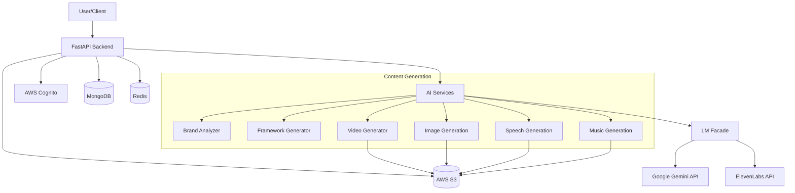

# TOF.ai

TOF.ai is an AI-powered video generation platform for brand awareness. The platform guides users through a brand strategy framework with multiple choice options, then uses AI to generate scripts, visuals/images, speech and music before finally combining everything into a social media video.

## Tech Stack

### Core Technologies
- **Backend**: FastAPI
- **Database**: MongoDB for persistent storage
- **Caching**: Redis for session/job caching and real-time data
- **Object Storage**: AWS S3 for media files
- **Authentication**: AWS Cognito for user authentication
- **Deployment**: Google Cloud Run

### AI Components
- **AI Orchestration**: LangGraph for workflow orchestration
- **LLM Models**: 
  - Google Gemini 2.0 Flash & 2.5 Flash for text generation
  - Google Gemini Imagen 3 for image generation
  - Google Gemini 2.5 Flash TTS for speech synthesis
  - ElevenLabs for music generation
- **Agent Framework**: Langchain for tool-enabled agents
- **Video Processing**: MoviePy for video composition

## Architecture Overview



## Environment Setup

The application uses environment variables for configuration. These are managed through a `.tofai-secrets.env` file in the project root directory.

### Local Development Setup

1. Create your environment file from the template:
   ```bash
   ./scripts/create-env-file.sh
   ```

2. Edit the `.tofai-secrets.env` file with your actual configuration values:
   ```bash
   # Use your preferred text editor
   nano .tofai-secrets.env
   ```

3. Run the local development setup:
   ```bash
   ./init_local.sh
   ```

4. The environment file is automatically loaded by the application at startup, and it's excluded from version control for security.

### Environment Variables

Key environment variables include:

- **Server**: `PORT`, `DEBUG`, `ENVIRONMENT`
- **MongoDB**: `MONGODB_URI`, `DATABASE_NAME`
- **Redis**: `REDIS_HOST`, `REDIS_PORT`, `REDIS_USER`, `REDIS_SECRET`
- **AWS S3**: `AWS_ACCESS_KEY_ID`, `AWS_SECRET_ACCESS_KEY`, `S3_REGION`
- **AI Services**: 
  - `GEMINI_API_PROJECT_NUMBER`, `GEMINI_API_SECRET`
  - `ELEVEN_TTS_SECRET`
  - `GOOGLE_SEARCH_API_KEY`, `GOOGLE_CSE_ID`
- **Authentication**: `COGNITO_REGION`, `COGNITO_USER_POOL_ID`, `COGNITO_CLIENT_ID`, etc.
- **Security**: `SECRET_KEY`

### Cloud Deployment

The application is deployed on Google Cloud Run with automated CI/CD via GitHub Actions:

1. **Automatic Deployment**: Push to `main` branch triggers deployment
2. **Environment Variables**: Managed as GitHub repository secrets
3. **Container Registry**: Uses Google Cloud Build
4. **Production URL**: https://tofai-backend-708610753332.us-west1.run.app

## API Endpoints

### Authentication
- **Login**: `GET /api/auth/login`
  - Description: Redirects to Cognito login page
  - Query Parameters: 
    - `state` (Optional): String to be returned after authentication

- **Logout**: `GET /api/auth/logout`
  - Description: Logs out the user and clears session cookies

- **Callback**: `GET /api/auth/callback`
  - Description: Handler for Cognito authentication callback
  - Query Parameters:
    - `code`: Authorization code from Cognito
    - `state` (Optional): State string passed during login

- **Get Current User**: `GET /api/auth/user`
  - Description: Returns the current authenticated user's information
  - Response Model:
    ```json
    {
      "id": "string",
      "username": "string",
      "email": "string",
      "cognito:groups": ["string"]
    }
    ```

### Session Management
- **Create Session**: `POST /api/sessions`
  - Description: Creates a new user session
  - Authentication: Required
  - Response Model:
    ```json
    {
      "id": "string",
      "created_at": "datetime",
      "updated_at": "datetime",
      "status": "integer",
      "result": "object",
      "framework_id": "string",
      "current_step_id": "string"
    }
    ```

- **Get Session**: `GET /api/sessions/{session_id}`
  - Description: Get details of a specific session
  - Path Parameters:
    - `session_id`: Session ID
  - Authentication: Required
  - Response: Session object

- **Delete Session**: `DELETE /api/sessions/{session_id}`
  - Description: Delete a session
  - Path Parameters:
    - `session_id`: Session ID
  - Authentication: Required
  - Response: 204 No Content

- **List User Sessions**: `GET /api/sessions/user/me`
  - Description: Get all sessions for the current user
  - Authentication: Required
  - Response: Array of Session objects

### Framework Generation
- **Initial Input**: `POST /api/framework/steps/initial_input`
  - Description: Submit initial brand information
  - Query Parameters:
    - `session_id`: Session ID to update
  - Request Body:
    ```json
    {
      "framework_id": "string",
      "brand_link": "string"
    }
    ```
  - Authentication: Required
  - Response:
    ```json
    {
      "job_id": "string",
      "created_at": "datetime",
      "framework_id": "string",
      "next_api": "string",
      "wait_for_user_action": "boolean"
    }
    ```

- **Generate Options**: `POST /api/framework/steps/{step_id}/generate`
  - Description: Generate options for a specific framework step
  - Path Parameters:
    - `step_id`: Framework step ID
  - Query Parameters:
    - `session_id`: Session ID to update
  - Request Body:
    ```json
    {
      "framework_id": "string",
      "step_id": "string"
    }
    ```
  - Authentication: Required
  - Response:
    ```json
    {
      "job_id": "string",
      "framework_id": "string",
      "step_id": "string",
      "created_at": "datetime",
      "next_api": "string",
      "wait_for_user_action": "boolean"
    }
    ```

- **Select Option**: `POST /api/framework/steps/{step_id}/select`
  - Description: Select an option for a framework step
  - Path Parameters:
    - `step_id`: Framework step ID
  - Query Parameters:
    - `session_id`: Session ID to update
    - `option_index`: Index of the selected option
    - `result_index`: Index of the result group to select from (default: 0)
  - Request Body:
    ```json
    {
      "framework_id": "string"
    }
    ```
  - Authentication: Required
  - Response:
    ```json
    {
      "job_id": "string",
      "created_at": "datetime",
      "framework_id": "string",
      "next_api": "string",
      "wait_for_user_action": "boolean"
    }
    ```

### Feedback Management
- **Submit Feedback**: `POST /api/feedback`
  - Description: Submit user feedback on generated options
  - Request Body:
    ```json
    {
      "id": "string (optional)",
      "session_id": "string",
      "step_id": "string",
      "context_id": "string",
      "feedback_type": "positive|negative",
      "feedback_qual": "string (optional)",
      "framework_id": "string"
    }
    ```
  - Authentication: Required
  - Response: Feedback object

- **Get Feedback**: `GET /api/feedback/{feedback_id}`
  - Description: Retrieve specific feedback
  - Authentication: Required
  - Response: Feedback object

- **Delete Feedback**: `DELETE /api/feedback/{feedback_id}`
  - Description: Delete feedback
  - Authentication: Required
  - Response: 204 No Content

### Jobs
- **Get Job Status**: `GET /api/jobs/{job_id}`
  - Description: Check the status of an asynchronous job
  - Path Parameters:
    - `job_id`: Job ID
  - Authentication: Required
  - Response:
    ```json
    {
      "id": "string",
      "session_id": "string",
      "created_at": "datetime",
      "completed_at": "datetime",
      "status": "string",
      "progress": "integer",
      "tasks_completed": ["string"],
      "error": "string"
    }
    ```

### Health
- **Health Check**: `GET /api/health`
  - Description: API health check endpoint
  - Response:
    ```json
    {
      "status": "string",
      "environment": "string",
      "database_initialized": "boolean"
    }
    ```

## Data Models

### User
```json
{
  "id": "string",
  "username": "string",
  "email": "string",
  "created_at": "datetime",
  "updated_at": "datetime"
}
```

### SessionStatus (Enum)
```
UNDEFINED = 0
STARTED = 1
EXPIRED = 2
```

### Session
```json
{
  "id": "string",
  "created_at": "datetime",
  "updated_at": "datetime",
  "expired_at": "datetime",
  "status": "SessionStatus",
  "result": "FrameworkResult",
  "framework_id": "string",
  "current_step_id": "string"
}
```

### JobStatus (Enum)
```
UNDEFINED = 0
PENDING = 1
PROCESSING = 2
COMPLETED = 3
FAILED = 4
CANCELED = 5
```

### Job
```json
{
  "id": "string",
  "session_id": "string",
  "created_at": "datetime",
  "completed_at": "datetime",
  "status": "JobStatus",
  "progress": "integer",
  "tasks_completed": ["string"],
  "error": "string"
}
```

### Feedback
```json
{
  "id": "string",
  "session_id": "string",
  "step_id": "string",
  "context_id": "string",
  "created_at": "datetime",
  "feedback_type": "positive|negative",
  "feedback_qual": "string",
  "framework_id": "string",
  "step_version": "integer"
}
```

### Framework Models
```json
{
  "FrameworkResult": {
    "id": "string",
    "step_results": ["FrameworkStepResult"]
  },
  
  "FrameworkStepResult": {
    "id": "string",
    "result": ["ResultOptions"],
    "display_to_user": "boolean"
  },
  
  "ResultOptions": {
    "result_options": ["string or MediaUri"],
    "context_ids": ["string"],
    "selected_option": "integer"
  },
  
  "MediaUri": {
    "uri": "string"
  }
}
```

## Local Development

### Prerequisites
- Python 3.10 or higher
- Access to MongoDB (cloud or local)
- Access to Redis (cloud or local)
- Required API keys (Gemini, ElevenLabs, AWS, etc.)

### Quick Start
1. Clone the repository
2. Run `./scripts/create-env-file.sh` to create environment file
3. Update `.tofai-secrets.env` with your API keys and credentials
4. Run `./init_local.sh` to start the development server
5. Access the API at http://localhost:8000
6. View API documentation at http://localhost:8000/docs

### Development Features
- Hot reload enabled in development mode
- Comprehensive API documentation via FastAPI's built-in Swagger UI
- Structured logging for debugging
- Environment-based configuration management
- Automated testing setup with pytest

## Production Deployment

The application is configured for deployment on Google Cloud Run with the following features:
- Automatic scaling based on traffic
- SSL termination and custom domain support
- Environment variable management via GitHub secrets
- Automated CI/CD pipeline via GitHub Actions
- Health checks and monitoring
- Multi-worker configuration for production workloads
