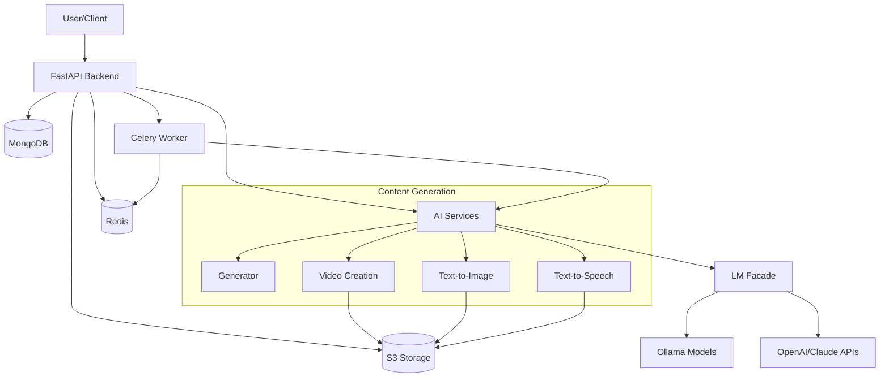

# TOF.ai

TOF.ai is an AI-powered video generation platform for brand awareness. The platform guides users through a brand strategy with multiple choice options, then uses AI to generate script, visuals/images, speech and music before finally combining everything into a social media video.

## Architecture Overview



## Tech Stack

- **Backend**: FastAPI
- **Database**: MongoDB (storage) and Redis (caching/messaging)
- **Task Queue**: Celery
- **AI Orchestration**: LangGraph
- **LLM Support**: OpenAI, Claude API (cloud), Ollama (local models)
- **Object Storage**: S3-compatible storage (AWS S3, MinIO, etc.)

## Features

- Brand strategy framework development with a config-driven approach
- AI-generated content scripts
- AI-generated visuals
- Text-to-speech voiceovers
- Background music generation
- Video compilation
- End-to-end workflow orchestration

## Local Development Setup

### Prerequisites

- Python 3.10+
- Docker and Docker Compose
- Ollama (optional, for local LLM support)

### Getting Started

1. Clone the repository:
   ```bash
   git clone https://github.com/yourusername/tof-ai.git
   cd tof-ai
   ```

2. Initialize the local development environment:
   ```bash
   ./init_local.sh
   ```

   This script will:
   - Create and activate a Python virtual environment
   - Install dependencies
   - Start MongoDB and Redis using Docker Compose
   - Create a default .env file if it doesn't exist
   - Start the FastAPI application and Celery worker

3. Alternatively, you can follow these steps manually:

   a. Create and activate a virtual environment:
   ```bash
   python -m venv venv
   source venv/bin/activate  # On Windows: venv\Scripts\activate
   ```

   b. Install the dependencies:
   ```bash
   pip install -r requirements.txt
   ```

   c. Start the MongoDB and Redis services using Docker Compose:
   ```bash
   docker-compose up -d mongo redis
   ```

   d. Run the application locally:
   ```bash
   uvicorn main:app --reload
   ```

   e. In a separate terminal, start the Celery worker:
   ```bash
   celery -A api.celery_worker worker --loglevel=info
   ```

4. The API will be available at http://localhost:8000
   - API Documentation: http://localhost:8000/docs

### Environment Variables

Create a `.env` file in the root directory with the following variables:

```
# Server
PORT=8000
DEBUG=True
ENVIRONMENT=development

# Database
MONGODB_URI=mongodb://localhost:27017
DATABASE_NAME=tofai

# Redis
REDIS_URI=redis://localhost:6379/0

# AI Services
CLAUDE_API_KEY=your_claude_api_key
OPENAI_API_KEY=your_openai_api_key

# Celery settings
CELERY_BROKER_URL=redis://localhost:6379/1
CELERY_RESULT_BACKEND=redis://localhost:6379/1

# Storage
S3_BUCKET=tofai-media
S3_REGION=us-east-1
AWS_ACCESS_KEY_ID=your_aws_access_key
AWS_SECRET_ACCESS_KEY=your_aws_secret_key
```

## API Endpoints

- **Health Check**: `/api/health`
- **Sessions**: `/api/sessions`
- **Framework Generation**: 
  - `/api/framework/steps/{step_id}/generate`
  - `/api/framework/steps/{step_id}/select`
  - `/api/framework/steps/initial_input`
- **Jobs**: `/api/jobs`

## Project Structure

```
tof-ai/
├── api/                     # API routes and endpoints
│   ├── routes/              # API route modules
│   ├── models.py            # API models
│   ├── dependencies.py      # FastAPI dependencies
│   └── celery_worker.py     # Celery worker configuration
├── config/                  # Configuration
│   └── settings.py          # App settings
├── models/                  # Data models
│   ├── job_db.py            # Job database models
│   └── session_db.py        # Session database models
├── services/                # Business logic
│   ├── ai/                  # AI generation services
│   │   ├── configs/         # Framework configuration files
│   │   ├── tasks/           # AI tasks
│   │   ├── ai_orchestrator.py  # AI orchestration
│   │   ├── framework_model.py  # Framework models
│   │   ├── lm_facade.py     # Language model wrapper
│   │   ├── state.py         # State management
│   │   ├── script_audio_service.py # Script to audio service
│   │   └── tts_service.py   # Text-to-speech service
│   └── storage/             # Storage services
│       ├── database.py      # Database access
│       └── object_store.py  # Object storage (S3)
├── tests/                   # Unit tests
├── main.py                  # Application entry point
├── Dockerfile               # Docker definition
├── docker-compose.yml       # Docker Compose services
├── init_local.sh            # Local development setup script
└── requirements.txt         # Python dependencies
```

## Running with Docker

To run the entire application stack with Docker:

```bash
docker-compose up -d
```

## Framework Configuration

TOF.ai uses a config-driven approach for AI prompt engineering and workflow orchestration. Framework configurations are defined in JSON files in the `services/ai/configs/` directory. The main framework for brand awareness videos is defined in `brand_awareness_framework.json`.

## Development Notes

- The application uses LangGraph for AI workflow orchestration
- The LM Facade provides a unified interface to different LLM providers
- Text-to-image, text-to-speech, and background music generation are implemented as separate services
- The object store service handles file uploads and downloads from S3-compatible storage